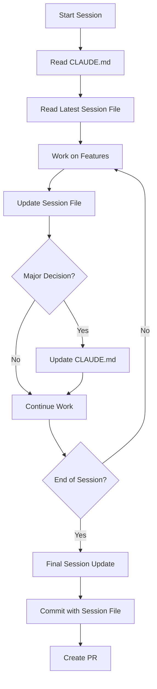

# PROJECT DEVELOPMENT RULES - READ THIS FIRST

**FAILURE TO FOLLOW THESE RULES WILL RESULT IN YOUR CODE BEING REJECTED**

This document contains the ONLY acceptable way to work on this project. No exceptions. No shortcuts. No "I think this way is better." Follow these rules exactly or find another project.

## ⚠️ ENFORCEMENT & COMPLIANCE

### Automated Rule Enforcement

**Every rule in this document is enforced by automation. You CANNOT bypass them.**

1. **Pre-commit Hooks** (Runs on EVERY commit)
   ```bash
   # .husky/pre-commit
   - Lint check (blocks if failed)
   - Type check (blocks if failed)
   - Test check (blocks if failed)
   - File size check (blocks files > 200 lines)
   - Forbidden patterns check (console.log, any type without @ts-ignore-mvp)
   - Session file update check (reminds to update)
   - Credentials file protection (blocks if .credentials modified)
   ```

2. **GitHub Actions** (Runs on EVERY push)
   ```yaml
   - Branch name validation (must match pattern)
   - Commit message validation (must match format)
   - Code coverage check (blocks if below threshold)
   - Security scan (blocks on vulnerabilities)
   - Documentation check (blocks if docs missing)
   - Neo4j query analysis (blocks cartesian products)
   ```

3. **PR Validation** (Cannot merge without)
   - All CI checks passing
   - Required approvals (2 for main, 1 for develop)
   - Session file linked
   - No unresolved comments
   - Updated claude.md if new patterns

### How Rules Are Enforced

| Rule | Enforcement Method | Consequence of Violation |
|------|-------------------|-------------------------|
| No console.log | ESLint + Pre-commit | Commit blocked |
| No any type | TypeScript + CI | PR blocked |
| Test coverage | Jest/Codecov | PR blocked |
| Branch naming | GitHub Actions | Push rejected |
| Commit format | Commitlint | Commit rejected |
| No .credentials edit | Pre-commit hook | Commit blocked |
| File size limit | Custom script | Commit blocked |
| No production testing | Environment checks | Deploy blocked |
| PR template | GitHub settings | PR cannot be created |
| Documentation | Custom CI check | PR blocked |

### Agent Compliance Checklist

**BEFORE starting work:**
- [ ] Read CLAUDE.md for context
- [ ] Check latest session file
- [ ] Create new session file
- [ ] Pull latest develop branch
- [ ] Create properly named branch

**DURING work:**
- [ ] Update session file every 2 hours
- [ ] Use /tmp for temporary scripts
- [ ] Never edit .credentials
- [ ] Run tests after changes
- [ ] Keep files under 200 lines

**BEFORE committing:**
- [ ] Update session file
- [ ] Run pnpm turbo run lint
- [ ] Run pnpm turbo run test
- [ ] Check coverage hasn't decreased
- [ ] Use proper commit message format
- [ ] Update CLAUDE.md if needed

**BEFORE creating PR:**
- [ ] Final session file update
- [ ] Run Documentation Specialist to update all docs
- [ ] Verify documentation matches code
- [ ] All tests passing
- [ ] Link GitHub issue
- [ ] Fill PR template completely
- [ ] Add correct labels

### Violation Tracking

**Three Strike System:**
1. **First violation**: Warning + education
2. **Second violation**: Code review required for all changes
3. **Third violation**: Repository access restricted

**Automatic violations (instant rejection):**
- Pushing to main directly
- Disabling CI checks
- Modifying .credentials
- Removing tests
- Decreasing coverage
- Security vulnerabilities

### Rule Discovery for New Agents

**FOR AI AGENTS (Claude, GPT, etc.):**
AI agents should AUTOMATICALLY at session start:
1. Read this claude.md file FIRST
2. Read CLAUDE.md for current project state
3. Check latest session file in /docs/sessions/
4. Create or update session file immediately
5. Follow all rules without being told

**The user should NOT need to tell agents to follow these rules - they should be automatic behavior.**

**FOR HUMAN DEVELOPERS:**
Run the onboarding script once:
```bash
./scripts/onboarding.sh
```

**The onboarding script will:**
- Display this document
- Check environment setup  
- Verify git configuration
- Create first session file
- Run test suite
- Show available commands

**AI Agent Automatic Behavior:**
```
1. Start of conversation → Read claude.md + CLAUDE.md
2. User makes request → Update session file
3. Make changes → Update session file
4. Encounter issue → Update session file  
5. Resolve issue → Update session file
6. User asks question → Update session file
7. Before commit → Final session file update
```

**No manual instruction needed - this is DEFAULT behavior**

---

## 🤖 SPECIALIZED SUBAGENTS

### Available Specialists in `.claude/agents/`

| Specialist | Use For | Invoke When |
|------------|---------|-------------|
| **Project Coordinator** | Planning, task breakdown, delegation | Starting new features |
| **Neo4j Specialist** | Graph schemas, Cypher queries, optimization | Database work needed |
| **Backend API Specialist** | REST APIs, business logic, authentication | Server-side development |
| **Frontend React Specialist** | React components, UI/UX, state management | Client-side development |
| **DevOps Specialist** | CI/CD, deployment, monitoring | Infrastructure work |
| **Testing QA Specialist** | Test strategy, test writing, coverage | Quality assurance |
| **Security Specialist** | Security audits, vulnerability fixes | Security concerns |
| **Documentation Specialist** | Technical docs, API docs, changelog | EVERY code change |
| **Product Manager** | Feature specs, GitHub issues, backlog | Feature planning |

### Agent Usage Rules

1. **Complex Features:** Start with Project Coordinator
2. **Specific Tasks:** Use domain specialist directly
3. **MANDATORY:** Documentation Specialist after EVERY code change
4. **Always Update:** Session files after agent work
5. **Chain Work:** Let agents hand off to each other
6. **Document:** Agent decisions in session files

### Documentation Update Rule (ENFORCED)
**After ANY code change by ANY agent:**
```
Code Change → Documentation Specialist → Updates all affected docs
```
**This is NOT optional - Documentation Specialist MUST run after every change**

### Example Agent Workflow
```
User: "Add user authentication"
  ↓
Product Manager: Creates GitHub issues with specs
  ↓
Coordinator: Plans and delegates
  ↓
Neo4j Agent: Designs User nodes
  ↓
Documentation Agent: Updates database schema docs
  ↓
Backend Agent: Creates auth endpoints
  ↓
Documentation Agent: Updates API docs
  ↓
Frontend Agent: Builds login UI
  ↓
Documentation Agent: Updates component docs
  ↓
Testing Agent: Writes test suite
  ↓
Security Agent: Reviews implementation
  ↓
Documentation Agent: Updates security docs
  ↓
DevOps Agent: Deploys to staging
  ↓
Documentation Agent: Updates deployment docs & changelog
```

---

## ⚡ QUICK REFERENCE - MONOREPO COMMANDS

```bash
# Initial setup (run once)
./scripts/setup-local.sh

# Daily development
pnpm dev                    # Start all services
pnpm dev:backend           # Start backend only
pnpm dev:frontend          # Start frontend only

# Before committing
pnpm turbo run lint --filter=[origin/develop]
pnpm turbo run test --filter=[origin/develop]
pnpm turbo run build --filter=[origin/develop]

# Database operations
pnpm db:migrate            # Run migrations
pnpm db:seed              # Seed test data

# Testing
pnpm test:all             # Test everything
pnpm --filter backend test # Test specific package
pnpm test:e2e             # Run E2E tests

# Deployment
./scripts/deploy-backend.sh [env]
./scripts/deploy-frontend.sh [env]
./scripts/deploy-all.sh [env]
```

---

## 🚀 DEVELOPMENT PHASES

### Phase 1: MVP Development (CURRENT PHASE)
**Goal: Ship working features fast**

#### Allowed Shortcuts (MVP ONLY)
- TODO comments allowed with issue number: `// TODO: #123 - Optimize this query`
- Can deploy with warnings (not errors)
- Minimum 60% test coverage acceptable
- Can use `any` type with `// @ts-ignore-mvp` comment
- Manual testing acceptable for non-critical paths
- Documentation can be minimal (update before Phase 2)
- Can have duplicate code marked with `// DUPLICATE-MVP: Will refactor`

#### NOT Allowed (Even in MVP)
- Skipping security measures
- Hardcoding secrets
- Deploying broken builds
- Ignoring critical bugs
- Direct database access from frontend
- Skipping PR reviews
- Force pushing to develop

#### MVP Checklist Before Phase 2
- [ ] Core features working
- [ ] Basic authentication implemented
- [ ] Database schema stable
- [ ] API endpoints defined
- [ ] Deployment pipeline working
- [ ] Basic monitoring in place

### Phase 2: Production Stabilization
**Triggered by: First production deployment**

#### Immediate Actions (Week 1)
1. Remove all `// @ts-ignore-mvp` comments
2. Fix all TODO comments or create issues
3. Increase test coverage to 80%
4. Remove duplicate code
5. Complete documentation
6. Set up error tracking (Sentry)
7. Enable all GitHub branch protections
8. Security audit

#### New Rules (Phase 2 Onwards)
- NO new features without tests
- NO deployment with console warnings
- All code must be properly typed
- Full documentation required
- Performance benchmarks required
- Load testing before major releases
- Rollback plan for every deployment
- 24-hour staging period before production

### Phase 3: Scale & Optimize
**Triggered by: 1000+ active users OR 3 months in production**

- 90% test coverage requirement
- Performance SLAs enforced
- Automated penetration testing
- Chaos engineering practices
- Feature flags for all new features
- A/B testing framework
- Complete API versioning
- Disaster recovery procedures

---

## 🚨 CRITICAL RULES - VIOLATE THESE AND YOU'RE OUT

1. **NEVER test in production**
2. **NEVER deploy to production manually**
3. **NEVER use production endpoints for local testing**
4. **NEVER commit directly to main branch**
5. **NEVER store secrets, passwords, or API keys in code**
6. **NEVER skip code review**
7. **NEVER deploy untested code**
8. **NEVER ignore failing tests**
9. **NEVER use `any` type in TypeScript without explicit approval** *(See MVP exceptions)*
10. **NEVER copy-paste code - if you write it twice, you're doing it wrong** *(See MVP exceptions)*

---

## 📋 DOCUMENT MAINTENANCE RULE

**THIS DOCUMENT IS A LIVING SPECIFICATION**

This claude.md file is the single source of truth for this project and MUST be updated:

- **After every feature implementation** - Document new patterns, services, or components
- **After architecture decisions** - Update structure, technology choices, integration patterns
- **After workflow changes** - Update deployment scripts, testing procedures, git workflows
- **After discovering edge cases** - Add new rules to prevent future mistakes
- **After adding new services/components** - Update project structure, API contracts, deployment procedures
- **After security reviews** - Update security rules and validation requirements
- **After performance optimizations** - Document caching strategies, query optimizations
- **After incident post-mortems** - Add rules to prevent recurrence

### Update Checklist
When completing any feature or task, ask:
1. Did we introduce a new pattern? → Document it
2. Did we add a new service/component? → Add to project structure
3. Did we change deployment process? → Update deployment section
4. Did we find a better way? → Update the relevant section
5. Did we add new dependencies? → Document why and how to use
6. Did we create new environment variables? → Add to documentation
7. Did we establish new conventions? → Make them rules

**FAILURE TO KEEP THIS DOCUMENT UPDATED WILL CAUSE PROJECT CHAOS**

---

## 📁 MONOREPO STRUCTURE - FOLLOW EXACTLY

```
alb-market/                    # Monorepo root
├── packages/
│   ├── backend/              # Backend API service
│   │   ├── src/
│   │   │   ├── controllers/ # Route controllers
│   │   │   ├── services/    # Business logic
│   │   │   ├── models/      # Neo4j models & schemas
│   │   │   ├── middleware/  # Express middleware
│   │   │   ├── utils/       # Backend utilities
│   │   │   ├── config/      # Backend configuration
│   │   │   └── cypher/      # Cypher query files
│   │   ├── tests/
│   │   ├── package.json
│   │   └── tsconfig.json
│   ├── frontend/            # Web application
│   │   ├── src/
│   │   │   ├── components/  # React components
│   │   │   ├── pages/       # Page components
│   │   │   ├── hooks/       # Custom React hooks
│   │   │   ├── services/    # API client services
│   │   │   ├── stores/      # State management
│   │   │   ├── utils/       # Frontend utilities
│   │   │   └── types/       # TypeScript types
│   │   ├── public/
│   │   ├── tests/
│   │   ├── package.json
│   │   └── tsconfig.json
│   ├── shared/              # Shared code between packages
│   │   ├── src/
│   │   │   ├── types/       # Shared TypeScript types
│   │   │   ├── constants/   # Shared constants
│   │   │   ├── utils/       # Shared utilities
│   │   │   └── validators/  # Shared validation logic
│   │   ├── package.json
│   │   └── tsconfig.json
│   └── database/            # Database management
│       ├── migrations/      # Neo4j migrations
│       ├── seeds/           # Seed data
│       ├── constraints/     # Neo4j constraints
│       ├── indexes/         # Neo4j indexes
│       └── backup/          # Backup scripts
├── infrastructure/          # Infrastructure as Code
│   ├── docker/
│   ├── kubernetes/
│   └── terraform/
├── scripts/                # Monorepo-level scripts (PERMANENT)
│   ├── setup.sh           # Setup entire monorepo
│   ├── deploy.sh          # Deploy all services
│   └── test-all.sh        # Run all tests
├── tmp/                   # Temporary scripts (GITIGNORED)
│   └── .gitkeep          # Keep folder in git structure
├── docs/                  # Project documentation
├── .github/               # GitHub Actions workflows
├── .credentials           # User-provided credentials (NEVER EDIT)
├── package.json           # Root package.json with workspaces
├── pnpm-workspace.yaml    # PNPM workspace configuration
├── turbo.json            # Turborepo configuration
├── .gitignore
├── .env.example
└── README.md
```

**MONOREPO RULES:**
- Use PNPM workspaces for package management
- Use Turborepo for build orchestration
- Each package MUST be independently deployable
- Shared code goes in `packages/shared` ONLY
- Never import across packages except from `shared`
- Each package has its own `package.json` and `tsconfig.json`
- Version packages independently using semantic versioning
- Maximum file length: 200 lines (split if larger)
- Each folder MUST have an index file that exports public API

---

## 🗂️ TEMPORARY SCRIPTS & CREDENTIALS

### /tmp Folder Rules

**Purpose:** Workspace for one-time scripts and temporary automation

```bash
# Example: Data migration script that runs once
/tmp/migrate-legacy-users.js

# Example: Quick analysis script
/tmp/analyze-performance.py

# Example: One-time data export
/tmp/export-quarterly-report.sh
```

**STRICT RULES:**
1. **NEVER commit files from /tmp to the repository** (gitignored)
2. **CREATE scripts here for one-time operations**
3. **USE for debugging, data analysis, migrations**
4. **DELETE scripts after use or leave for user reference**
5. **NEVER reference /tmp scripts from production code**
6. **NAME scripts descriptively**: `tmp/2024-01-15-fix-orphaned-nodes.cypher`

**When to use /tmp:**
- One-time data fixes
- Debugging scripts
- Performance analysis
- Data exports/imports
- Quick automation needs
- Testing hypotheses
- Temporary backup scripts

**When NOT to use /tmp:**
- Reusable utilities → Put in `/scripts`
- Package scripts → Put in `package.json`
- Deployment scripts → Put in `/scripts`
- Tests → Put in appropriate test folder

### .credentials File Rules

**Purpose:** Secure storage for user-provided credentials

```bash
# .credentials file format (KEY=VALUE)
PRODUCTION_DB_PASSWORD=secret123
AWS_SECRET_KEY=abc456
THIRD_PARTY_API_KEY=xyz789
```

**ABSOLUTE RULES:**
1. **NEVER EVER edit .credentials file as an agent**
2. **NEVER display .credentials contents**
3. **NEVER commit .credentials to git** (gitignored)
4. **ONLY read from .credentials when needed**
5. **ALWAYS tell user to add credentials there**

**Usage example:**
```bash
# In scripts, source the credentials
source .credentials
neo4j-admin backup --to=/backup --password=$PRODUCTION_DB_PASSWORD
```

**How to instruct users:**
```
"Please add your database password to the .credentials file:
PRODUCTION_DB_PASSWORD=your_password_here

I'll be able to use it securely without seeing or modifying it."
```

### .gitignore Configuration

```gitignore
# Temporary scripts folder
/tmp/*
!/tmp/.gitkeep

# Credentials file
.credentials

# Environment files
.env
.env.local
.env.*.local

# Standard ignores
node_modules/
dist/
build/
*.log
.DS_Store
```

---

## 📝 SESSION FILES & MEMORY MANAGEMENT

### Session Files (Work Journal)

**Purpose:** Document work progress for each development session, creating a journal for PRs

**File Location:** `/docs/sessions/`

**Naming Convention:**
```
YYYY-MM-DD-branch-name.md

Examples:
2024-01-15-feature-backend-user-auth.md
2024-01-16-bugfix-frontend-login-validation.md
2024-01-16-hotfix-database-connection-timeout.md
```

**Session File Template:**
```markdown
# Session: [Date] - [Branch Name]

## Context
**PR/Issue:** #123
**Started:** 2024-01-15 14:30
**Last Updated:** 2024-01-15 18:45

## Goals
- [ ] Implement user authentication endpoint
- [ ] Add password hashing with bcrypt
- [ ] Create JWT token generation
- [ ] Write unit tests for auth service

## Current State
- Database schema updated with User model
- Basic Express routes created
- Working on password validation logic

## Blockers/Issues
- **RESOLVED:** Neo4j connection timeout - increased pool size
- **PENDING:** Need clarification on token expiration policy

## Decisions Made
- Using bcrypt for password hashing (not argon2) due to better Neo4j driver compatibility
- JWT tokens expire after 24 hours
- Refresh tokens stored in httpOnly cookies

## Next Steps
1. Complete password validation
2. Add rate limiting to login endpoint
3. Implement refresh token rotation

## Files Modified
- packages/backend/src/services/AuthService.ts
- packages/backend/src/controllers/AuthController.ts
- packages/shared/src/types/User.ts
- packages/database/migrations/002-add-user-auth.cypher

## Test Commands
\```bash
pnpm --filter backend test auth
curl -X POST localhost:4000/api/auth/login -d '{"email":"test@example.com","password":"test123"}'
\```

## Notes for Next Session
- Remember to add email verification flow
- Check if we need rate limiting on all auth endpoints
- Review OWASP authentication guidelines
```

**UPDATE RULES - CONTINUOUS DOCUMENTATION:**
1. **Create** immediately when starting any work session
2. **Update after EVERY:**
   - User request received
   - Change made to the application
   - Issue or error encountered
   - Decision made
   - Question asked by user
   - Solution implemented
3. **Purpose:** Enable immediate session recovery if interrupted
4. **Final update** BEFORE creating commit/PR
5. **Keep** high-level but detailed enough to resume work

**Update Frequency Example:**
```
14:30 - User asks to add authentication
14:31 - [UPDATE] Added goal: implement auth
14:45 - [UPDATE] Created AuthService.ts
14:50 - [UPDATE] Encountered Neo4j connection issue
14:55 - [UPDATE] Resolved by increasing pool size
15:10 - [UPDATE] Added JWT token generation
15:15 - User requests email verification
15:16 - [UPDATE] Added new requirement: email verification
```

### CLAUDE.md (Persistent Memory)

**Purpose:** Technical context that persists across Claude conversations

**File Location:** `/CLAUDE.md` (root level)

**What to Include:**
```markdown
# Claude Persistent Memory

## Project Overview
ALB Market - Graph-based marketplace using Neo4j

## Current Sprint
Working on user authentication system

## Technical Decisions
- Neo4j for graph database
- Node.js + Express for backend
- React + Vite for frontend  
- PNPM workspaces for monorepo
- JWT for authentication

## Known Issues
- Neo4j connection pools need tuning for production
- Frontend bundle size needs optimization

## Common Commands
\```bash
# Start everything
pnpm dev

# Run specific tests
pnpm --filter backend test:watch

# Database operations
pnpm db:migrate
\```

## Environment Setup Notes
- Neo4j requires Java 11+
- Use Node 18 LTS
- PNPM version 8.x required

## Active Feature Flags
- NEW_AUTH_FLOW=false (still using old flow)
- ENABLE_CACHE=true
```

### Memory Management Strategy



### Best Practices

1. **Session Files = Journal**: Think of them as a developer's diary
2. **CLAUDE.md = Technical Memory**: Critical technical context only
3. **Frequency**: Update session files regularly, CLAUDE.md only for major changes
4. **PR Integration**: Link session file in PR description for context
5. **Cleanup**: Archive old session files quarterly to `/docs/sessions/archive/`

### GitHub Integration

Add to PR template:
```markdown
## 📔 Session Journal
Link to session file: [/docs/sessions/YYYY-MM-DD-branch-name.md]

## Summary from Session
[Copy key points from session file]
```

### Benefits of This System

1. **Context Preservation**: Never lose track of decisions and progress
2. **PR Documentation**: Automatic journal of development process
3. **Onboarding**: New developers can read session files to understand decisions
4. **Debugging**: Historical record of what was tried and why
5. **Knowledge Transfer**: Sessions become team documentation

### Alternative: Claude Projects Feature

**Note:** Claude has a built-in Projects feature that can maintain context across conversations. However, session files provide:
- Git-tracked history
- Team visibility
- PR documentation
- Offline accessibility

Use both systems together:
- Claude Projects for AI memory
- Session files for team documentation

---

## 🗄️ NEO4J GRAPH DATABASE RULES

### Node Naming Conventions

```cypher
// GOOD - PascalCase for labels, camelCase for properties
CREATE (u:User {userId: $id, email: $email, createdAt: datetime()})

// BAD - Wrong casing
CREATE (u:user {user_id: $id, Email: $email})
```

### Relationship Rules

```cypher
// GOOD - UPPERCASE with underscores for relationships
MATCH (u:User)-[:PURCHASED]->(p:Product)
MATCH (u:User)-[:BELONGS_TO]->(g:Group)

// BAD - Wrong format
MATCH (u:User)-[:purchased]->(p:Product)
MATCH (u:User)-[:BelongsTo]->(g:Group)
```

### Cypher Query Standards

```cypher
// ALWAYS use parameters to prevent injection
// GOOD
MATCH (u:User {email: $email})
RETURN u

// NEVER concatenate strings
// BAD
MATCH (u:User {email: '" + email + "'})
RETURN u
```

### Model Definition Rules

```typescript
// Every Neo4j model MUST define:
interface UserNode {
  // Required system fields
  nodeId: string;        // Internal Neo4j ID
  id: string;           // Business ID (UUID)
  createdAt: DateTime;  // Creation timestamp
  updatedAt: DateTime;  // Last update timestamp
  
  // Business fields
  email: string;
  name: string;
}

// Relationship interfaces
interface PurchasedRelationship {
  purchasedAt: DateTime;
  amount: number;
  currency: string;
}
```

### Query Organization

```typescript
// Store complex queries in separate .cypher files
// packages/backend/src/cypher/user-queries.cypher

// getUserWithPurchases
MATCH (u:User {id: $userId})
OPTIONAL MATCH (u)-[r:PURCHASED]->(p:Product)
RETURN u, collect({relationship: r, product: p}) as purchases

// In code, load and execute
const query = await loadCypherQuery('user-queries/getUserWithPurchases');
const result = await session.run(query, { userId });
```

### Transaction Rules

```typescript
// ALWAYS use transactions for multiple operations
async function transferOwnership(fromId: string, toId: string, itemId: string) {
  const session = driver.session();
  const tx = session.beginTransaction();
  
  try {
    // Remove old ownership
    await tx.run(`
      MATCH (from:User {id: $fromId})-[r:OWNS]->(item:Item {id: $itemId})
      DELETE r
    `, { fromId, itemId });
    
    // Create new ownership
    await tx.run(`
      MATCH (to:User {id: $toId}), (item:Item {id: $itemId})
      CREATE (to)-[:OWNS {since: datetime()}]->(item)
    `, { toId, itemId });
    
    await tx.commit();
  } catch (error) {
    await tx.rollback();
    throw error;
  } finally {
    await session.close();
  }
}
```

### Index and Constraint Rules

```cypher
// MANDATORY indexes for every node label
CREATE INDEX user_id_index FOR (u:User) ON (u.id);
CREATE INDEX user_email_index FOR (u:User) ON (u.email);

// MANDATORY uniqueness constraints
CREATE CONSTRAINT user_id_unique ON (u:User) ASSERT u.id IS UNIQUE;
CREATE CONSTRAINT user_email_unique ON (u:User) ASSERT u.email IS UNIQUE;

// Composite indexes for common queries
CREATE INDEX user_status_created FOR (u:User) ON (u.status, u.createdAt);
```

### Migration Standards

```javascript
// packages/database/migrations/001_create_user_model.js
module.exports = {
  up: async (driver) => {
    const session = driver.session();
    try {
      // Create constraints
      await session.run('CREATE CONSTRAINT user_id_unique ON (u:User) ASSERT u.id IS UNIQUE');
      await session.run('CREATE CONSTRAINT user_email_unique ON (u:User) ASSERT u.email IS UNIQUE');
      
      // Create indexes
      await session.run('CREATE INDEX user_created_index FOR (u:User) ON (u.createdAt)');
    } finally {
      await session.close();
    }
  },
  
  down: async (driver) => {
    const session = driver.session();
    try {
      await session.run('DROP CONSTRAINT user_id_unique');
      await session.run('DROP CONSTRAINT user_email_unique');
      await session.run('DROP INDEX user_created_index');
    } finally {
      await session.close();
    }
  }
};
```

### Performance Rules

1. **ALWAYS limit results in development**
   ```cypher
   MATCH (u:User) RETURN u LIMIT 100  // Always add LIMIT in dev
   ```

2. **Use EXPLAIN and PROFILE**
   ```cypher
   PROFILE MATCH (u:User)-[:PURCHASED]->(p:Product) RETURN u, p
   // Check db hits - should be < 1000 for most queries
   ```

3. **Avoid cartesian products**
   ```cypher
   // BAD - Creates cartesian product
   MATCH (u:User), (p:Product) WHERE u.age > 18 AND p.category = 'Electronics'
   
   // GOOD - Use relationships or separate queries
   MATCH (u:User) WHERE u.age > 18
   WITH u
   MATCH (p:Product) WHERE p.category = 'Electronics'
   ```

4. **Batch operations**
   ```cypher
   // Process in batches for large updates
   CALL apoc.periodic.iterate(
     "MATCH (u:User) WHERE u.status = 'pending' RETURN u",
     "SET u.status = 'active', u.activatedAt = datetime()",
     {batchSize: 1000}
   )
   ```

---

## 🌿 GIT WORKFLOW - MONOREPO EDITION

### Branch Naming Convention

```
feature/[package]/ticket-number-description    # Package-specific features
feature/shared/ticket-number-description       # Shared package changes
feature/all/ticket-number-description          # Cross-package features
bugfix/[package]/ticket-number-description     # Package-specific fixes
hotfix/[package]/ticket-number-critical-fix    # Production emergencies
chore/[package]/ticket-number-description      # Maintenance tasks

Examples:
feature/backend/JIRA-123-user-auth
feature/frontend/JIRA-124-login-page
feature/all/JIRA-125-oauth-integration
bugfix/shared/JIRA-126-type-definitions
```

### The ONLY Acceptable Git Flow

1. **Start from latest develop branch**
   ```bash
   git checkout develop
   git pull origin develop
   ```

2. **Create feature branch**
   ```bash
   git checkout -b feature/JIRA-123-user-authentication
   ```

3. **Work in small, atomic commits**
   ```bash
   # BAD - Don't do this
   git commit -m "stuff"
   git commit -m "more changes"
   
   # GOOD - Do this
   git commit -m "feat: add password validation to signup form"
   git commit -m "test: add unit tests for password validator"
   git commit -m "docs: update API documentation for auth endpoint"
   ```

4. **Commit Message Format (ENFORCED BY HOOKS)**
   ```
   <type>(<scope>): <subject> (max 50 chars)
   
   <body> (optional, max 72 chars per line)
   
   <footer> (optional, references issues)
   ```
   
   **Types:**
   - `feat`: New feature
   - `fix`: Bug fix
   - `docs`: Documentation only
   - `style`: Formatting, no code change
   - `refactor`: Code restructuring
   - `test`: Adding tests
   - `chore`: Maintenance
   - `perf`: Performance improvement
   - `build`: Build system changes
   
   **Scopes (MANDATORY):**
   - `backend`: Backend package changes
   - `frontend`: Frontend package changes
   - `shared`: Shared package changes
   - `db`: Database changes
   - `infra`: Infrastructure changes
   - `all`: Changes affecting multiple packages
   
   **Examples:**
   ```
   feat(backend): add user authentication endpoint
   fix(frontend): resolve login form validation
   chore(all): update dependencies across packages
   feat(db): add user-product relationship
   ```

5. **Before EVERY push**
   ```bash
   # Run checks for affected packages only
   pnpm turbo run lint --filter=[origin/develop]
   pnpm turbo run test --filter=[origin/develop]
   pnpm turbo run build --filter=[origin/develop]
   
   # Or run all if changing shared code
   pnpm run lint:all
   pnpm run test:all
   pnpm run build:all
   ```

6. **Rebase before creating PR**
   ```bash
   git checkout develop
   git pull origin develop
   git checkout feature/JIRA-123-user-authentication
   git rebase develop
   # Fix conflicts if any
   git push --force-with-lease origin feature/JIRA-123-user-authentication
   ```

7. **Pull Request Rules (GitHub)**
   - Title: `[#IssueNumber] Brief description of change`
   - Use GitHub PR template (MANDATORY)
   - Link GitHub issue using `Closes #123` or `Fixes #123`
   - Required sections in PR description:
     - **What**: Summary of changes
     - **Why**: Link to issue and context
     - **How**: Implementation approach
     - **Testing**: How to verify changes
     - **Screenshots**: For any UI changes
     - **Checklist**: Must be completed
   - Labels required: `package:backend`, `package:frontend`, or `package:shared`
   - At least 2 approvals required
   - All GitHub Actions checks must pass
   - No force pushing after review starts

---

## 🐙 GITHUB WORKFLOW & AUTOMATION

### Issue Management Rules

#### Issue Creation
```markdown
# Bug Report Template (.github/ISSUE_TEMPLATE/bug_report.md)
**Package**: [backend/frontend/shared/database]
**Environment**: [development/staging/production]
**Priority**: [P0-Critical/P1-High/P2-Medium/P3-Low]

## Description
Clear description of the bug

## Steps to Reproduce
1. Step one
2. Step two
3. Step three

## Expected Behavior
What should happen

## Actual Behavior
What actually happens

## Screenshots/Logs
Any relevant screenshots or error logs

## System Info
- OS: 
- Browser: 
- Node version:
```

```markdown
# Feature Request Template (.github/ISSUE_TEMPLATE/feature_request.md)
**Package**: [backend/frontend/shared/all]
**Type**: [enhancement/new-feature]

## Problem Statement
What problem does this solve?

## Proposed Solution
How should we solve it?

## Acceptance Criteria
- [ ] Criterion 1
- [ ] Criterion 2
- [ ] Criterion 3

## Technical Considerations
Any technical constraints or considerations
```

#### Issue Labels (MANDATORY)
- `package:backend` - Backend changes
- `package:frontend` - Frontend changes
- `package:shared` - Shared package changes
- `type:bug` - Bug fixes
- `type:feature` - New features
- `type:chore` - Maintenance
- `priority:P0` - Critical (fix immediately)
- `priority:P1` - High (fix this sprint)
- `priority:P2` - Medium (fix next sprint)
- `priority:P3` - Low (backlog)
- `status:blocked` - Blocked by dependency
- `status:in-progress` - Being worked on
- `status:ready-for-review` - PR submitted

### Pull Request Template

```markdown
<!-- .github/pull_request_template.md -->
## 📋 Description
Brief description of changes

Closes #[issue_number]

## 📦 Package(s) Affected
- [ ] backend
- [ ] frontend
- [ ] shared
- [ ] database
- [ ] infrastructure

## 🔄 Type of Change
- [ ] Bug fix (non-breaking change)
- [ ] New feature (non-breaking change)
- [ ] Breaking change (fix or feature that breaks existing functionality)
- [ ] Documentation update
- [ ] Performance improvement
- [ ] Refactoring

## ✅ Testing
- [ ] Unit tests pass locally
- [ ] Integration tests pass locally
- [ ] E2E tests pass (if applicable)
- [ ] Manual testing completed

### Test Evidence
```bash
# Paste test output here
pnpm test:all
✓ All tests passed
```

## 📸 Screenshots (if UI changes)
Before | After
--- | ---
[screenshot] | [screenshot]

## 🚀 Deployment Notes
Any special deployment considerations?

## ✔️ Checklist
- [ ] My code follows the project style guidelines
- [ ] I have performed self-review
- [ ] I have added tests that prove my fix/feature works
- [ ] New and existing unit tests pass locally
- [ ] I have updated documentation (if needed)
- [ ] I have updated claude.md (if introducing new patterns)
- [ ] No console.log statements
- [ ] No commented code
- [ ] No TODO comments
```

### GitHub Actions Configuration

#### Required Workflows

```yaml
# .github/workflows/ci.yml
name: CI Pipeline

on:
  pull_request:
    branches: [develop, main]
  push:
    branches: [develop, main]

jobs:
  detect-changes:
    runs-on: ubuntu-latest
    outputs:
      backend: ${{ steps.filter.outputs.backend }}
      frontend: ${{ steps.filter.outputs.frontend }}
      shared: ${{ steps.filter.outputs.shared }}
    steps:
      - uses: actions/checkout@v3
      - uses: dorny/paths-filter@v2
        id: filter
        with:
          filters: |
            backend:
              - 'packages/backend/**'
            frontend:
              - 'packages/frontend/**'
            shared:
              - 'packages/shared/**'

  test-backend:
    needs: detect-changes
    if: needs.detect-changes.outputs.backend == 'true' || needs.detect-changes.outputs.shared == 'true'
    runs-on: ubuntu-latest
    services:
      neo4j:
        image: neo4j:5
        env:
          NEO4J_AUTH: neo4j/testpassword
        ports:
          - 7687:7687
    steps:
      - uses: actions/checkout@v3
      - uses: pnpm/action-setup@v2
      - uses: actions/setup-node@v3
        with:
          node-version: '18'
          cache: 'pnpm'
      - run: pnpm install
      - run: pnpm --filter backend lint
      - run: pnpm --filter backend typecheck
      - run: pnpm --filter backend test:coverage
      - run: pnpm --filter backend build
      - uses: codecov/codecov-action@v3
        with:
          files: ./packages/backend/coverage/lcov.info
          flags: backend

  test-frontend:
    needs: detect-changes
    if: needs.detect-changes.outputs.frontend == 'true' || needs.detect-changes.outputs.shared == 'true'
    runs-on: ubuntu-latest
    steps:
      - uses: actions/checkout@v3
      - uses: pnpm/action-setup@v2
      - uses: actions/setup-node@v3
        with:
          node-version: '18'
          cache: 'pnpm'
      - run: pnpm install
      - run: pnpm --filter frontend lint
      - run: pnpm --filter frontend typecheck
      - run: pnpm --filter frontend test:coverage
      - run: pnpm --filter frontend build
      - uses: codecov/codecov-action@v3
        with:
          files: ./packages/frontend/coverage/lcov.info
          flags: frontend

  e2e-tests:
    needs: [test-backend, test-frontend]
    if: github.event_name == 'pull_request'
    runs-on: ubuntu-latest
    steps:
      - uses: actions/checkout@v3
      - run: pnpm test:e2e

  security-scan:
    runs-on: ubuntu-latest
    steps:
      - uses: actions/checkout@v3
      - run: pnpm audit
      - uses: aquasecurity/trivy-action@master
```

#### Branch Protection Rules (MANDATORY)

Configure in GitHub Settings → Branches:

**For `main` branch:**
- Require pull request reviews (2 approvals)
- Dismiss stale PR approvals when new commits pushed
- Require review from CODEOWNERS
- Require status checks:
  - `ci / test-backend`
  - `ci / test-frontend`
  - `ci / security-scan`
- Require branches to be up to date
- Require conversation resolution
- Require signed commits
- Include administrators
- Restrict who can push (only CI/CD)

**For `develop` branch:**
- Require pull request reviews (1 approval)
- Require status checks:
  - `ci / test-backend`
  - `ci / test-frontend`
- Require branches to be up to date

### CODEOWNERS File

```bash
# .github/CODEOWNERS
# Global owners
* @lead-developer @senior-developer

# Package-specific owners
/packages/backend/ @backend-team
/packages/frontend/ @frontend-team
/packages/shared/ @lead-developer
/packages/database/ @database-team

# Critical files
/infrastructure/ @devops-team @lead-developer
/.github/ @lead-developer
/scripts/deploy*.sh @devops-team @lead-developer
```

### Automated Release Process

```yaml
# .github/workflows/release.yml
name: Release

on:
  push:
    branches: [main]

jobs:
  release:
    runs-on: ubuntu-latest
    steps:
      - uses: actions/checkout@v3
      - uses: actions/setup-node@v3
      - run: pnpm install
      - run: pnpm build:all
      
      # Create GitHub release
      - uses: softprops/action-gh-release@v1
        with:
          generate_release_notes: true
          tag_name: v${{ steps.version.outputs.version }}
      
      # Deploy to production
      - run: ./scripts/deploy-all.sh production
```

### PR Review Checklist (For Reviewers)

- [ ] Code follows project conventions
- [ ] Tests are adequate and passing
- [ ] No security vulnerabilities introduced
- [ ] Performance impact considered
- [ ] Database migrations are reversible
- [ ] Documentation updated
- [ ] Error handling is appropriate
- [ ] Logging is sufficient
- [ ] No hardcoded values
- [ ] Types are properly defined in shared package

---

## 💻 CODE STANDARDS - NON-NEGOTIABLE

### File Structure Template

```typescript
/**
 * @file UserService.ts
 * @description Handles all user-related business logic
 * @author Your Name
 * @date 2024-01-01
 */

// 1. Imports - grouped and ordered
import { external } from 'external-package';

import { Component } from '@/components';
import { utilFunction } from '@/utils';
import { UserType } from '@/types';

// 2. Constants
const MAX_RETRY_ATTEMPTS = 3;

// 3. Types/Interfaces (if local to file)
interface LocalType {
  field: string;
}

// 4. Main export
export class UserService {
  // Class implementation
}

// 5. Helper functions (if needed)
function helperFunction(): void {
  // Implementation
}
```

### Function Rules

```typescript
// EVERY function MUST have:
// 1. JSDoc comment
// 2. Type annotations
// 3. Single responsibility
// 4. Maximum 20 lines

/**
 * Validates user email format
 * @param email - User email address
 * @returns true if valid, false otherwise
 * @throws {ValidationError} If email is null
 */
export function validateEmail(email: string): boolean {
  if (!email) {
    throw new ValidationError('Email cannot be null');
  }
  
  const emailRegex = /^[^\s@]+@[^\s@]+\.[^\s@]+$/;
  return emailRegex.test(email);
}
```

### Error Handling

```typescript
// NEVER use console.log for errors
// ALWAYS use proper error handling

// BAD
try {
  doSomething();
} catch (error) {
  console.log(error);  // NEVER DO THIS
}

// GOOD
try {
  doSomething();
} catch (error) {
  logger.error('Failed to do something', {
    error: error instanceof Error ? error.message : 'Unknown error',
    stack: error instanceof Error ? error.stack : undefined,
    context: { userId, action: 'doSomething' }
  });
  
  // Re-throw or handle appropriately
  throw new ApplicationError('Operation failed', error);
}
```

### Code Duplication Rules

```typescript
// If you write similar code twice, you're wrong
// Create a generic function/component

// BAD - Duplicated logic
function getUserById(id: string) {
  const response = await fetch(`/api/users/${id}`);
  if (!response.ok) throw new Error('Failed');
  return response.json();
}

function getPostById(id: string) {
  const response = await fetch(`/api/posts/${id}`);
  if (!response.ok) throw new Error('Failed');
  return response.json();
}

// GOOD - Generic function
function getResourceById<T>(resource: string, id: string): Promise<T> {
  const response = await fetch(`/api/${resource}/${id}`);
  if (!response.ok) throw new Error(`Failed to fetch ${resource}`);
  return response.json();
}

const user = await getResourceById<User>('users', userId);
const post = await getResourceById<Post>('posts', postId);
```

---

## 📝 DOCUMENTATION FORMAT - EXACT TEMPLATE

### Technical Documentation Structure

**MANDATORY: A `/docs/technical/` directory with the following structure:**

```
docs/
├── technical/
│   ├── README.md           # Index of all technical documentation
│   ├── architecture.md     # System architecture overview
│   ├── components/         # UI component documentation
│   │   └── ComponentName.md
│   ├── services/           # Service/business logic documentation
│   │   └── ServiceName.md
│   ├── models/             # Data model documentation
│   │   └── ModelName.md
│   ├── apis/               # API endpoint documentation
│   │   └── endpoint-group.md
│   ├── database/           # Database schema documentation
│   │   ├── schema.md
│   │   └── migrations.md
│   ├── flows/              # Business flow documentation
│   │   └── flow-name.md
│   ├── infrastructure/     # Deployment and infrastructure
│   │   ├── deployment.md
│   │   ├── scaling.md
│   │   └── environments.md
│   ├── configuration/      # Configuration documentation
│   │   ├── feature-flags.md
│   │   ├── env-variables.md
│   │   └── settings.md
│   ├── integrations/       # External service integrations
│   │   ├── third-party.md
│   │   ├── webhooks.md
│   │   └── event-bus.md
│   ├── security/           # Security documentation
│   │   ├── authentication.md
│   │   ├── authorization.md
│   │   ├── permissions.md
│   │   └── vulnerabilities.md
│   ├── testing/            # Testing strategies
│   │   ├── test-strategy.md
│   │   ├── test-data.md
│   │   └── e2e-scenarios.md
│   ├── monitoring/         # Monitoring and observability
│   │   ├── metrics.md
│   │   ├── alerts.md
│   │   ├── dashboards.md
│   │   └── logs.md
│   ├── performance/        # Performance documentation
│   │   ├── benchmarks.md
│   │   ├── optimization.md
│   │   └── caching.md
│   ├── troubleshooting/    # Debug and troubleshooting
│   │   ├── common-issues.md
│   │   ├── debug-guide.md
│   │   └── error-codes.md
│   ├── releases/           # Release management
│   │   ├── release-process.md
│   │   ├── rollback.md
│   │   └── changelog.md
│   ├── dependencies/       # Dependency documentation
│   │   ├── packages.md
│   │   └── versions.md
│   ├── events/             # Event-driven architecture
│   │   ├── event-schemas.md
│   │   ├── message-queue.md
│   │   └── event-sourcing.md
│   └── jobs/               # Background jobs and cron
│       ├── scheduled-tasks.md
│       ├── background-jobs.md
│       └── job-queues.md
```

### Component Documentation Template (MANDATORY)

**File: `/docs/technical/components/ComponentName.md`**

```markdown
# ComponentName

## Purpose
Single sentence describing what this component does.

## Location
`src/components/ComponentName.tsx`

## Props
| Prop | Type | Required | Default | Description |
|------|------|----------|---------|-------------|
| id | string | Yes | - | Unique identifier |
| onSubmit | () => void | Yes | - | Submit handler |
| disabled | boolean | No | false | Disable interaction |

## State
| State | Type | Initial | Description |
|-------|------|---------|-------------|
| isLoading | boolean | false | Loading state |
| data | Object[] | [] | Component data |

## Methods
| Method | Parameters | Returns | Description |
|--------|------------|---------|-------------|
| handleSubmit | event: Event | void | Processes form submission |
| validateInput | value: string | boolean | Validates user input |

## Events
| Event | Payload | Description |
|-------|---------|-------------|
| onStateChange | {state: State} | Fired when state changes |
| onError | {error: Error} | Fired on error |

## Dependencies
- ServiceName: For data fetching
- UtilName: For data transformation
- ComponentName: Child component

## Usage Example
\```tsx
<ComponentName 
  id="unique-id"
  onSubmit={handleSubmit}
  disabled={false}
/>
\```
```

### Service Documentation Template (MANDATORY)

**File: `/docs/technical/services/ServiceName.md`**

```markdown
# ServiceName

## Purpose
Single sentence describing what this service does.

## Location
`src/services/ServiceName.ts`

## Class: ServiceName

### Constructor
| Parameter | Type | Description |
|-----------|------|-------------|
| config | Config | Service configuration |
| logger | Logger | Logger instance |

### Public Methods

#### methodName(params)
**Purpose:** What this method does
**Parameters:**
- `param1: Type` - Description
- `param2: Type` - Description

**Returns:** `Promise<ReturnType>` - Description

**Throws:**
- `ErrorType` - When this happens

**Example:**
\```typescript
const result = await service.methodName(param1, param2);
\```

### Private Methods
_List private methods with brief descriptions only_

## Dependencies
- External libraries used
- Other services this depends on
- Database connections required

## Error Codes
| Code | Description | Recovery |
|------|-------------|----------|
| ERR_001 | Connection failed | Retry with backoff |
| ERR_002 | Invalid input | Validate input |
```

### Model/Interface Documentation Template (MANDATORY)

**File: `/docs/technical/models/ModelName.md`**

```markdown
# ModelName

## Purpose
What this model represents in the system.

## Location
`src/types/ModelName.ts`

## Schema

### Interface: IModelName
| Field | Type | Required | Description | Validation |
|-------|------|----------|-------------|------------|
| id | string | Yes | Unique identifier | UUID v4 |
| name | string | Yes | Display name | 1-100 chars |
| email | string | Yes | Email address | Valid email |
| createdAt | Date | Yes | Creation timestamp | ISO 8601 |
| metadata | Object | No | Additional data | JSON object |

### Enum: ModelStatus
| Value | Description |
|-------|-------------|
| ACTIVE | Model is active |
| INACTIVE | Model is inactive |
| DELETED | Model is soft deleted |

## Relationships
- Has many: RelatedModel (foreign key: modelId)
- Belongs to: ParentModel (foreign key: parentId)

## Indexes
- Primary: id
- Unique: email
- Composite: [status, createdAt]

## Methods
| Method | Returns | Description |
|--------|---------|-------------|
| toJSON() | Object | Serializes for API |
| validate() | boolean | Validates all fields |
```

### API Documentation Template (MANDATORY)

**File: `/docs/technical/apis/resource-name.md`**

```markdown
# Resource API

## Base URL
`/api/v1/resource`

## Endpoints

### GET /resource
**Purpose:** List all resources

**Query Parameters:**
| Parameter | Type | Required | Default | Description |
|-----------|------|----------|---------|-------------|
| page | number | No | 1 | Page number |
| limit | number | No | 20 | Items per page |
| sort | string | No | created_at | Sort field |

**Response:** `200 OK`
\```json
{
  "data": [ResourceObject],
  "meta": {
    "total": 100,
    "page": 1,
    "limit": 20
  }
}
\```

**Errors:**
- `400` - Invalid parameters
- `401` - Unauthorized
- `500` - Server error

### POST /resource
**Purpose:** Create new resource

**Body:**
\```json
{
  "name": "string",
  "description": "string"
}
\```

**Response:** `201 Created`
\```json
{
  "data": ResourceObject
}
\```
```

### Flow Documentation Template (MANDATORY)

**File: `/docs/technical/flows/flow-name.md`**

```markdown
# Flow Name

## Purpose
What business process this flow implements.

## Trigger
What initiates this flow (user action, cron job, event, etc.)

## Steps

1. **Step Name**
   - Component/Service: `ServiceName.methodName()`
   - Input: What goes in
   - Output: What comes out
   - Error Handling: What happens on failure

2. **Step Name**
   - Component/Service: `ComponentName.action()`
   - Input: Previous step output
   - Output: Transformed data
   - Error Handling: Rollback procedure

## State Transitions
| From State | Action | To State | Conditions |
|------------|--------|----------|------------|
| INITIAL | submit | PROCESSING | Valid input |
| PROCESSING | complete | COMPLETED | Success |
| PROCESSING | fail | FAILED | Error occurred |

## Error Recovery
- How to retry
- How to rollback
- How to notify

## Monitoring
- Key metrics to track
- Success/failure indicators
- Performance benchmarks
```

### Code Documentation Rules

#### Every File Must Have

```typescript
/**
 * @file filename.ts
 * @description What this file does (one line)
 * @module ModuleName
 * @requires Dependencies
 */
```

#### Every Class Must Have

```typescript
/**
 * Handles user authentication and session management
 * 
 * @class UserService
 * @implements {IUserService}
 * @extends {BaseService}
 */
export class UserService extends BaseService implements IUserService {
```

#### Every Method Must Have

```typescript
/**
 * Authenticates user with email and password
 * 
 * @memberof UserService
 * @method authenticate
 * @param {string} email - User email address
 * @param {string} password - User password
 * @returns {Promise<User>} Authenticated user object
 * @throws {AuthenticationError} Invalid credentials
 * @throws {ValidationError} Invalid input format
 * 
 * @example
 * const user = await userService.authenticate('user@example.com', 'password');
 */
```

#### Every Interface Must Have

```typescript
/**
 * User data structure
 * 
 * @interface IUser
 * @property {string} id - Unique user identifier
 * @property {string} email - User email address
 * @property {UserRole} role - User permission level
 * @property {Date} createdAt - Account creation timestamp
 */
```

### Infrastructure Documentation Template (MANDATORY)

**File: `/docs/technical/infrastructure/deployment.md`**

```markdown
# Deployment Documentation

## Environments
| Environment | Purpose | URL | Branch |
|-------------|---------|-----|--------|
| Development | Active development | dev.example.com | develop |
| Staging | Pre-production testing | staging.example.com | staging |
| Production | Live system | api.example.com | main |

## Services
| Service | Type | Resources | Scaling |
|---------|------|-----------|---------|
| API Server | Node.js | 2 CPU, 4GB RAM | Auto 2-10 instances |
| Database | PostgreSQL | 4 CPU, 16GB RAM | Read replicas |
| Cache | Redis | 1 CPU, 2GB RAM | Cluster mode |

## Deployment Process
1. Build Docker image
2. Run automated tests
3. Push to registry
4. Update Kubernetes manifests
5. Apply rolling update
6. Run health checks
7. Monitor metrics

## Rollback Procedure
1. Identify faulty deployment
2. Revert to previous image tag
3. Apply immediate update
4. Verify system health
```

### Monitoring Documentation Template (MANDATORY)

**File: `/docs/technical/monitoring/alerts.md`**

```markdown
# Alert Configuration

## Critical Alerts (Page immediately)
| Alert | Condition | Action |
|-------|-----------|--------|
| API Down | 5xx > 10% for 2 min | Restart service, check logs |
| Database Connection | Connections > 90% | Scale connection pool |
| Disk Space | > 85% full | Clean logs, expand storage |

## Warning Alerts (Notify team)
| Alert | Condition | Action |
|-------|-----------|--------|
| High Latency | p95 > 1s | Review slow queries |
| Memory Usage | > 75% | Monitor for leaks |
| Queue Backlog | > 1000 items | Scale workers |

## Metrics to Track
- Request rate (req/sec)
- Error rate (errors/min)
- Response time (p50, p95, p99)
- Database query time
- Cache hit ratio
- Queue depth
- CPU/Memory usage
```

### Error Codes Documentation Template (MANDATORY)

**File: `/docs/technical/troubleshooting/error-codes.md`**

```markdown
# System Error Codes

## Format: PREFIX_NUMBER
- AUTH_xxx: Authentication errors
- VAL_xxx: Validation errors
- DB_xxx: Database errors
- API_xxx: External API errors
- SYS_xxx: System errors

## Error Code Registry

| Code | HTTP Status | Message | Cause | Solution |
|------|-------------|---------|-------|----------|
| AUTH_001 | 401 | Invalid credentials | Wrong username/password | Verify credentials |
| AUTH_002 | 401 | Token expired | JWT token expired | Refresh token |
| AUTH_003 | 403 | Insufficient permissions | User lacks required role | Check user permissions |
| VAL_001 | 400 | Invalid input format | Malformed request body | Check API documentation |
| VAL_002 | 400 | Missing required field | Required field not provided | Include all required fields |
| DB_001 | 500 | Connection failed | Cannot connect to database | Check connection string |
| DB_002 | 500 | Query timeout | Query took too long | Optimize query, add index |
| API_001 | 502 | External service unavailable | Third-party API down | Retry with backoff |
| SYS_001 | 500 | Out of memory | Memory limit exceeded | Increase memory allocation |

## Client Error Handling
\```typescript
switch (error.code) {
  case 'AUTH_001':
    // Redirect to login
    break;
  case 'VAL_001':
    // Show validation errors
    break;
  case 'DB_001':
    // Show maintenance message
    break;
}
\```
```

### Configuration Documentation Template (MANDATORY)

**File: `/docs/technical/configuration/env-variables.md`**

```markdown
# Environment Variables

## Required Variables
| Variable | Description | Example | Secret |
|----------|-------------|---------|--------|
| NODE_ENV | Environment name | production | No |
| DATABASE_URL | PostgreSQL connection | postgresql://... | Yes |
| REDIS_URL | Redis connection | redis://... | Yes |
| JWT_SECRET | JWT signing key | random-256-bit | Yes |
| API_KEY | External API key | sk_live_... | Yes |

## Optional Variables
| Variable | Description | Default | Secret |
|----------|-------------|---------|--------|
| PORT | Server port | 3000 | No |
| LOG_LEVEL | Logging verbosity | info | No |
| MAX_CONNECTIONS | DB pool size | 20 | No |
| CACHE_TTL | Cache duration (sec) | 3600 | No |

## Feature Flags
| Flag | Description | Default | Environments |
|------|-------------|---------|--------------|
| ENABLE_NEW_UI | New UI components | false | dev, staging |
| USE_CACHE | Enable caching | true | all |
| DEBUG_MODE | Verbose logging | false | dev |

## Configuration Hierarchy
1. Environment variables (highest priority)
2. .env file
3. config/default.json
4. Hard-coded defaults (lowest priority)
```

### Documentation Update Rules

1. **BEFORE writing code** - Create/update the technical documentation
2. **AFTER implementation** - Verify documentation matches implementation
3. **DURING review** - Documentation updates are part of the PR

### README Structure (EXACT FORMAT)

```markdown
# Project Name

## Overview
One paragraph description of what this project does.

## Prerequisites
- Node.js >= 18.0.0
- PostgreSQL >= 14
- Redis >= 7.0

## Installation

\```bash
# Clone repository
git clone <repo-url>
cd project-name

# Install dependencies
npm install

# Setup environment
cp .env.example .env
# Edit .env with your values

# Run migrations
npm run migrate

# Start development
npm run dev
\```

## Scripts

| Command | Description |
|---------|-------------|
| `npm run dev` | Start development server |
| `npm run build` | Build for production |
| `npm run test` | Run all tests |
| `npm run deploy` | Deploy to production |

## Environment Variables

| Variable | Description | Required | Default |
|----------|-------------|----------|---------|
| DATABASE_URL | PostgreSQL connection string | Yes | - |
| REDIS_URL | Redis connection string | Yes | - |
| JWT_SECRET | JWT signing secret | Yes | - |

## API Documentation
See `/docs/api.md` for complete API documentation.

## Contributing
See `/docs/CONTRIBUTING.md` for contribution guidelines.
```

---

## 🚀 DEPLOYMENT - MONOREPO ORCHESTRATION

### Local Development Setup

```bash
# This script MUST exist and work for entire monorepo
./scripts/setup-local.sh
```

**setup-local.sh must:**
1. Check prerequisites (Node 18+, Neo4j, pnpm)
2. Install dependencies for all packages
3. Setup Neo4j database with constraints/indexes
4. Seed test data
5. Start all services concurrently
6. Open frontend in browser
7. Display service URLs and health status

### Package Scripts (MANDATORY in each package.json)

```json
{
  "scripts": {
    "dev": "Start development server",
    "build": "Build for production",
    "test": "Run tests",
    "lint": "Lint code",
    "typecheck": "TypeScript check",
    "clean": "Clean build artifacts"
  }
}
```

### Root Monorepo Scripts (MANDATORY)

```json
{
  "scripts": {
    "dev": "turbo run dev",
    "dev:backend": "turbo run dev --filter=backend",
    "dev:frontend": "turbo run dev --filter=frontend",
    "build:all": "turbo run build",
    "test:all": "turbo run test",
    "lint:all": "turbo run lint",
    "clean:all": "turbo run clean",
    "db:migrate": "pnpm --filter database migrate",
    "db:seed": "pnpm --filter database seed",
    "deploy:backend": "./scripts/deploy-backend.sh",
    "deploy:frontend": "./scripts/deploy-frontend.sh",
    "deploy:all": "./scripts/deploy-all.sh"
  }
}
```

### Deployment Scripts

```bash
# Deploy individual service
./scripts/deploy-backend.sh [environment]
./scripts/deploy-frontend.sh [environment]

# Deploy all services
./scripts/deploy-all.sh [environment]
```

**deploy-backend.sh must:**
1. Run backend tests
2. Build backend Docker image
3. Run database migrations
4. Deploy to Kubernetes/Cloud
5. Run health checks
6. Run API smoke tests
7. Rollback if any step fails

**deploy-frontend.sh must:**
1. Run frontend tests
2. Build production bundle
3. Upload to CDN/S3
4. Invalidate cache
5. Run E2E tests
6. Rollback if any step fails

**NEVER deploy manually. NEVER SSH to production. Use the scripts.**

---

## 🧪 TESTING REQUIREMENTS - MONOREPO

### Test Coverage Rules (Per Package)
- Backend: Minimum 85% coverage
- Frontend: Minimum 80% coverage
- Shared: 100% coverage (critical shared code)
- Database: 100% coverage for migrations
- Every PR must increase or maintain coverage

### Test Structure by Package

#### Backend Tests
```typescript
// packages/backend/tests/unit/services/UserService.test.ts
describe('UserService', () => {
  let neo4jDriver: Driver;
  
  beforeAll(async () => {
    // Use test database
    neo4jDriver = await createTestDriver();
  });
  
  afterEach(async () => {
    // Clean test data
    await cleanDatabase(neo4jDriver);
  });
  
  describe('createUser', () => {
    it('should create user node with relationships', async () => {
      // Test Neo4j operations
    });
  });
});
```

#### Frontend Tests
```typescript
// packages/frontend/tests/components/UserList.test.tsx
describe('UserList Component', () => {
  it('should render users from API', async () => {
    // Mock API calls
    const mockUsers = [{ id: '1', name: 'Test' }];
    jest.spyOn(api, 'getUsers').mockResolvedValue(mockUsers);
    
    // Test component
    const { getByText } = render(<UserList />);
    await waitFor(() => expect(getByText('Test')).toBeInTheDocument());
  });
});
```

#### Integration Tests (Cross-Package)
```typescript
// tests/integration/user-flow.test.ts
describe('User Registration Flow', () => {
  it('should register user through API and display in frontend', async () => {
    // Start backend server
    const backend = await startBackend();
    
    // Start frontend
    const frontend = await startFrontend();
    
    // Run E2E test
    await page.goto(frontend.url);
    await page.fill('[name="email"]', 'test@example.com');
    await page.click('[type="submit"]');
    
    // Verify in database
    const user = await neo4j.run('MATCH (u:User {email: $email}) RETURN u', 
      { email: 'test@example.com' });
    expect(user).toBeDefined();
  });
});
```

### Test Commands

```bash
# Test individual package
pnpm --filter backend test
pnpm --filter frontend test

# Test with coverage
pnpm --filter backend test:coverage

# Test only changed packages
pnpm turbo run test --filter=[origin/develop]

# Test everything
pnpm test:all

# E2E tests (requires all services running)
pnpm test:e2e
```

### Neo4j Test Database Rules

```typescript
// MANDATORY test utilities
export async function createTestDriver(): Promise<Driver> {
  return neo4j.driver('bolt://localhost:7687', 
    neo4j.auth.basic('neo4j', 'test'));
}

export async function cleanDatabase(driver: Driver): Promise<void> {
  const session = driver.session();
  try {
    // Delete all nodes and relationships
    await session.run('MATCH (n) DETACH DELETE n');
  } finally {
    await session.close();
  }
}

export async function seedTestData(driver: Driver): Promise<void> {
  // Add test data
}
```

### Test File Organization
```
packages/
├── backend/
│   └── tests/
│       ├── unit/          # Unit tests
│       ├── integration/   # Integration tests
│       └── fixtures/      # Test data
├── frontend/
│   └── tests/
│       ├── components/    # Component tests
│       ├── pages/        # Page tests
│       └── mocks/        # API mocks
└── shared/
    └── tests/            # Shared code tests

tests/                    # Monorepo-level tests
├── e2e/                 # End-to-end tests
└── integration/         # Cross-package integration

---

## 🔗 MONOREPO PACKAGE COMMUNICATION RULES

### Import Rules

```typescript
// GOOD - Import from shared package
import { UserType, validateEmail } from '@alb-market/shared';

// BAD - Direct import between packages
import { SomeService } from '../../../backend/src/services';

// BAD - Reaching into package internals
import { helper } from '@alb-market/shared/src/utils/helper';
```

### Package Dependencies

```json
// packages/backend/package.json
{
  "dependencies": {
    "@alb-market/shared": "workspace:*",
    // External dependencies
  }
}

// packages/frontend/package.json
{
  "dependencies": {
    "@alb-market/shared": "workspace:*",
    // External dependencies
  }
}
```

### API Communication Rules

```typescript
// Frontend MUST use typed API client
// packages/frontend/src/services/api/userApi.ts
import { UserType } from '@alb-market/shared';

export class UserApi {
  async getUser(id: string): Promise<UserType> {
    const response = await fetch(`${API_URL}/users/${id}`);
    return response.json();
  }
}

// Backend MUST return types from shared
// packages/backend/src/controllers/userController.ts
import { UserType } from '@alb-market/shared';

export async function getUser(req: Request, res: Response<UserType>) {
  const user = await userService.findById(req.params.id);
  res.json(user);
}
```

### Environment Variable Rules

```bash
# Root .env for shared config
NEO4J_URI=bolt://localhost:7687
NEO4J_USER=neo4j
NEO4J_PASSWORD=password

# packages/backend/.env for backend-specific
PORT=4000
JWT_SECRET=secret

# packages/frontend/.env for frontend-specific
VITE_API_URL=http://localhost:4000
```

### Build Order (Turborepo Configuration)

```json
// turbo.json
{
  "pipeline": {
    "build": {
      "dependsOn": ["^build"],
      "outputs": ["dist/**"]
    },
    "@alb-market/shared#build": {
      "outputs": ["dist/**"]
    },
    "@alb-market/backend#build": {
      "dependsOn": ["@alb-market/shared#build"],
      "outputs": ["dist/**"]
    },
    "@alb-market/frontend#build": {
      "dependsOn": ["@alb-market/shared#build"],
      "outputs": ["dist/**"]
    }
  }
}
```

### Version Management

```bash
# Version packages independently
cd packages/backend && npm version patch
cd packages/frontend && npm version minor
cd packages/shared && npm version major  # Breaking changes

# Publish order matters
pnpm --filter shared publish
pnpm --filter backend publish
pnpm --filter frontend publish
```

---

## 🔒 SECURITY RULES

### API Security

```typescript
// EVERY endpoint MUST have:
router.post('/api/resource',
  authenticate,           // Authentication middleware
  authorize(['admin']),   // Authorization middleware
  validateInput(schema),  // Input validation
  rateLimiter,           // Rate limiting
  async (req, res) => {
    // Handler
  }
);
```

### Data Validation

```typescript
// NEVER trust user input
// ALWAYS validate and sanitize

// BAD
const userId = req.params.id;
const user = await db.query(`SELECT * FROM users WHERE id = ${userId}`);

// GOOD
const userId = validateUUID(req.params.id);
const user = await db.query('SELECT * FROM users WHERE id = $1', [userId]);
```

---

## 🏗️ ARCHITECTURE PRINCIPLES

### 1. Separation of Concerns
- Controllers: HTTP handling only
- Services: Business logic only
- Models: Data structure only
- Utils: Pure functions only

### 2. Dependency Injection

```typescript
// BAD - Hard dependencies
class UserService {
  constructor() {
    this.db = new Database();  // Hard to test
  }
}

// GOOD - Injected dependencies
class UserService {
  constructor(private db: IDatabase) {
    // Easy to test with mocks
  }
}
```

### 3. Single Responsibility

```typescript
// BAD - Multiple responsibilities
class UserService {
  createUser() { }
  sendEmail() { }  // Should be in EmailService
  logActivity() { } // Should be in LogService
}

// GOOD - Single responsibility
class UserService {
  constructor(
    private emailService: EmailService,
    private logService: LogService
  ) {}
  
  createUser() {
    // Create user
    this.emailService.sendWelcome();
    this.logService.logActivity();
  }
}
```

---

## 📊 MONITORING & LOGGING

### Logging Format

```typescript
logger.info('Action performed', {
  userId: user.id,
  action: 'CREATE_POST',
  metadata: { postId: post.id },
  timestamp: new Date().toISOString()
});
```

### Required Metrics
- Response time for every endpoint
- Error rate by endpoint
- Database query performance
- Cache hit/miss ratio

---

## 🔄 CODE REVIEW CHECKLIST

Before requesting review, verify:

- [ ] All tests pass
- [ ] Code coverage maintained/increased
- [ ] No console.log statements
- [ ] No commented code
- [ ] No TODO comments
- [ ] All functions have JSDoc
- [ ] No hardcoded values
- [ ] Error handling in place
- [ ] Input validation complete
- [ ] Security middleware applied
- [ ] Database queries use parameters
- [ ] No duplicated code
- [ ] Follows file structure rules
- [ ] Commit messages follow format
- [ ] PR description complete
- [ ] Linked to ticket

---

## 🚫 COMMON MISTAKES THAT WILL GET YOUR PR REJECTED

1. **"It works on my machine"** - Test in Docker container
2. **"I'll add tests later"** - No tests = No merge
3. **"This is temporary"** - No temporary code in main
4. **"I'll refactor later"** - Do it right the first time
5. **"Nobody will notice"** - We notice everything
6. **"The linter is wrong"** - The linter is never wrong
7. **"This is how we did it at my last job"** - This isn't your last job

---

## 📞 WHEN TO ASK FOR HELP

Ask for help IMMEDIATELY if:
- You're about to duplicate code
- You're unsure about security implications
- You want to add a new dependency
- You think you found a better way (you probably didn't)
- You've been stuck for more than 30 minutes

---

## ⚡ PERFORMANCE RULES

1. **Database queries**: Use indexes, limit results, paginate
2. **API calls**: Implement caching, use batch operations
3. **Frontend**: Lazy load, optimize images, minimize bundles
4. **Backend**: Use queues for heavy operations, implement circuit breakers

---

## 🎯 FINAL WORDS

This document is not a suggestion. It's not a guideline. It's THE LAW.

Every rule exists because someone, somewhere, fucked up in exactly that way and caused a production incident.

Learn from their mistakes. Follow the rules. Ship quality code.

**Remember:**
- Good code is maintainable code
- Maintainable code follows standards
- Standards are non-negotiable

Now stop reading and start coding. The right way.